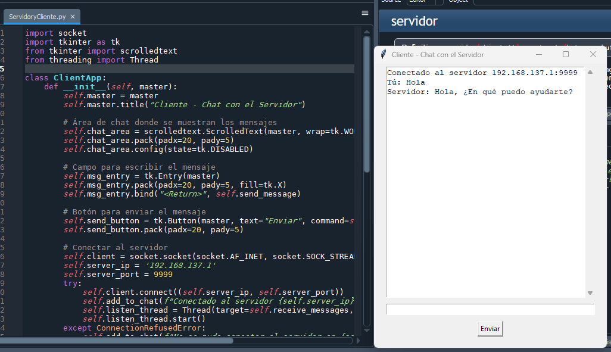

# Práctica: Servidor-Cliente en Python

## Integrantes 

SHANTI MARYSE GUTIÉRREZ MAGAÑA  
CÉSAR VILLASEÑOR SOTOMAYOR  
JESÚS GARCÍA PALOMERA  

## Descripción General
En esta práctica, se implementa una aplicación de red basada en la arquitectura cliente-servidor utilizando sockets en Python. Tanto el servidor como el cliente pueden manejar la comunicación de forma simultánea usando hilos (`threads`). La interfaz gráfica para ambas aplicaciones se desarrolla con Tkinter, proporcionando una ventana para visualizar los mensajes recibidos y enviar respuestas.

## Código del Servidor
El servidor se implementa utilizando la biblioteca `socket` para gestionar la comunicación en red y `threading` para manejar múltiples clientes de forma simultánea. La interfaz gráfica se desarrolla con `tkinter` para mostrar los mensajes y enviar respuestas.

### Principales Componentes del Código del Servidor
- **Socket del servidor**: Crea un socket TCP que se enlaza a la dirección IP y al puerto específicos, permitiendo la conexión desde cualquier dirección IP.
- **Interfaz Gráfica (Tkinter)**: Muestra los mensajes recibidos de los clientes y permite enviar respuestas desde una ventana.
- **Manejo de múltiples conexiones**: El servidor acepta conexiones de clientes de manera continua utilizando un hilo (`accept_thread`). Para cada cliente que se conecta, se crea un hilo separado para gestionar la recepción de mensajes.
- **Recepción de mensajes**: Cada mensaje recibido se muestra en el área de chat de la interfaz gráfica.
- **Envió de mensajes**: Permite al usuario del servidor enviar respuestas a los clientes conectados.

## Código del Cliente
El cliente se conecta al servidor utilizando sockets y, al igual que el servidor, cuenta con una interfaz gráfica que permite enviar y recibir mensajes. La comunicación se mantiene mediante hilos para escuchar mensajes del servidor de forma continua mientras se pueden enviar mensajes desde la interfaz.

### Principales Componentes del Código del Cliente
- **Socket del cliente**: Conecta al servidor utilizando la dirección IP y el puerto específicos.
- **Interfaz Gráfica (Tkinter)**: Muestra los mensajes recibidos del servidor y permite enviar mensajes desde una ventana.
- **Recepción de mensajes**: Se utiliza un hilo (`listen_thread`) para escuchar los mensajes que envía el servidor y mostrarlos en la ventana de chat.
- **Envió de mensajes**: Permite al usuario del cliente enviar mensajes al servidor desde la interfaz.

## Validación
A continuación, se presentan algunas capturas de pantalla de la validación del funcionamiento del sistema cliente-servidor:

- **Conexión inicial del cliente #1 al servidor**:
  
  

- **Envío de mensaje del servidor a cliente**:
  
  

- **Recepción del mensajes por parte del servidor y detección de errores de conexión**:
  
  

- **Respuesta del servidor al cliente #2**:
  
  

- **Visualización del interfaz del servidor**:
  
  

Estas capturas ilustran el proceso de conexión, envío y recepción de mensajes, confirmando que la comunicación entre el cliente y el servidor funciona de manera correcta.

## Conclusión
Este sistema de cliente-servidor permite crear un entorno de comunicación sencilla entre múltiples clientes y un servidor, utilizando una interfaz gráfica intuitiva. Es una práctica que sirve para comprender el manejo de sockets y el uso de `threading` para múltiples conexiones concurrentes en Python.

## Ejecución
Para ejecutar el sistema, primero inicia el servidor y asegúrate de que esté escuchando en la IP y puerto especificados. Luego, ejecuta el cliente, que se conectará a la dirección del servidor y podrá enviar y recibir mensajes. Ambos scripts deben ser ejecutados en un entorno Python con las librerías necesarias instaladas.
